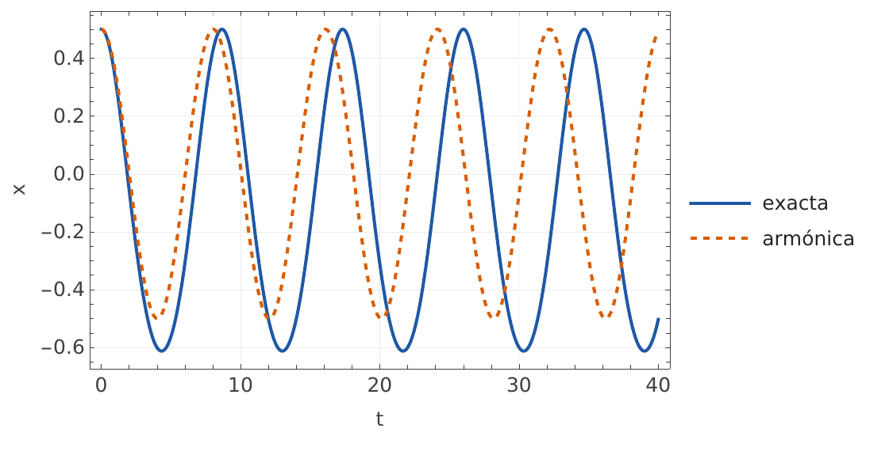
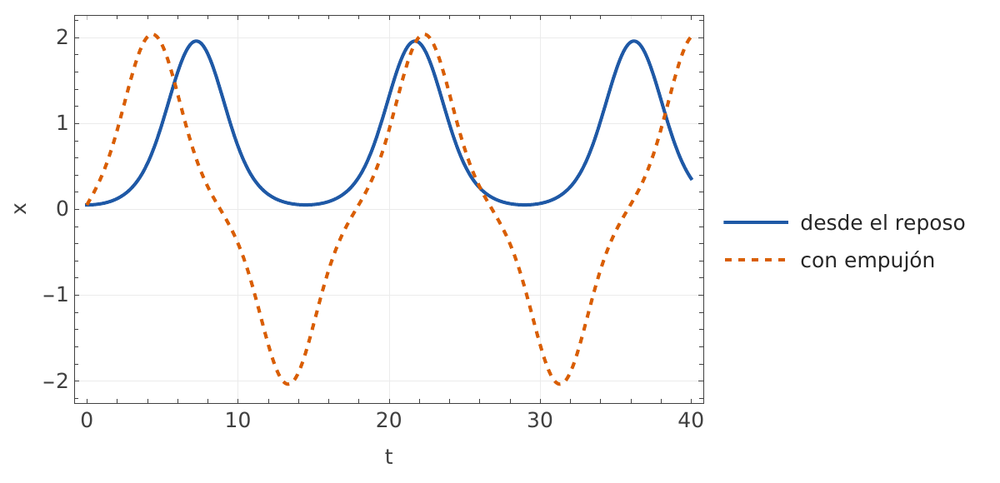

<p align="center"><a href="README.md">Español</a> · <b>English</b></p>

<h1 align="center">CMToolkit</h1>

<p align="center">
  <b>Classical mechanics in Wolfram Language: you set up the physics, the package shows the steps and draws the result.</b>
</p>

<p align="center">
  <a href="LICENSE"></a>
  
  
  <a href="https://github.com/vmtolosa/cm-toolkit/actions/workflows/check-repo.yml"></a>
</p>

<p align="center">
  
</p>

## Motivation

In a classical mechanics course, the algebra often hides the physics. This package was born in
the tutorial sessions of an undergraduate course so that someone who is just learning Mathematica
can compute and, above all, see what is going on: the potential, the equilibria, the modes, the
response to a force. Every function shows the intermediate steps in the order they would be done
by hand, to accompany the derivation rather than replace it.

## Why two languages

The canonical function names are in English, like the rest of Wolfram Language and the
literature. Each function also has a Spanish alias, so that a Spanish-speaking student can read
their code in their own language. Messages, steps and plot labels come out in the language the
user chooses with `$CMLanguage` (`"Spanish"`, the default, or `"English"`).

```wolfram
res = HarmonicExpansion[L, {x, t}, 0, u];   (* canonical name *)
ExpansionArmonica[L, {x, t}, 0, u] === res  (* Spanish alias: same result *)
(* True *)

$CMLanguage = "English";   (* from here on, messages, steps and labels in English *)
```

Error messages always carry the canonical name, even when the alias is called. Each function's
alias is listed in its help: `?HarmonicExpansion`.

## An example

A mass slides along a horizontal rail, attached to a spring of natural length `l0` whose other
end is fixed at a height `h` above the rail. If the spring is longer than that height, the center
is no longer stable and two equilibria appear on either side.

```wolfram
Needs["CMToolkit`"]

L = m/2 x'[t]^2 - k/2 (Sqrt[x[t]^2 + h^2] - l0)^2;

EquilibriumPoints[L, {x, t}]["Points"]
(* x = 0 always; x = ±Sqrt[l0^2 - h^2] if h < l0 *)

ClassifyEquilibrium[L, {x, t}, 0, u]["Conditions"]
(* minimum if l0 < h, maximum if l0 > h, critical if h == l0 *)

res = HarmonicExpansion[L, {x, t}, 0, u];
res["Omega2"]
(* k (h - l0)/(h m) *)

ShowSteps[res]
(* the table with the ten steps: effective potential, effective mass, Taylor series,
   harmonic Lagrangian, amplitude bound, equation of motion and frequency *)
```

With numbers, the exact solution is compared with the harmonic approximation (the figure at the
top, with a large initial deviation so the difference shows) and the motion is integrated from
any initial condition:

```wolfram
Lnum = L /. {m -> 1, k -> 1, h -> 1, l0 -> 1.6};

CompareHarmonic[Lnum, {x, t}, Sqrt[1.6^2 - 1], 0.5, 40]

solA = SolveMotion[Lnum, {x, t}, {0.05, 0}, 40];     (* from rest: stays in one well *)
solB = SolveMotion[Lnum, {x, t}, {0.05, 0.3}, 40];   (* with a push: visits both *)
```

<p align="center">
  
</p>

## What it can do today

| Block | Functions | Status |
| --- | --- | --- |
| Equilibria | `EquilibriumPoints`, `ClassifyEquilibrium` | Available |
| Small oscillations | `HarmonicExpansion`, `ShowSteps` | Available |
| Exact motion | `EnergyFunction`, `SolveMotion`, `CompareHarmonic`, `PhasePortrait` | Available |
| One-degree-of-freedom plots | `PotentialPlot`, `EquilibriumDiagram` | In development |
| Normal modes in 1, 2 and 3 dimensions | `SpringNetwork`, `NormalModes`, `ModeResponse`, animations | Specified |
| Damped and driven oscillator, Green's functions | `DampedOscillator`, `GreenFunction`, `GreenSolution`, interactive explorers | Specified |

The Spanish name of each function is in its help: `?HarmonicExpansion`.
The full plan, with the other topics of a classical mechanics course, is in the
[roadmap](docs/ROADMAP.md) (in Spanish).

## Roadmap

Source: [docs/ROADMAP.md](docs/ROADMAP.md). The topics follow the usual order of an undergraduate
classical mechanics course. Statuses:

- **Available**: already in `main`.
- **In development**: being implemented.
- **Specified**: has an approved specification in [`docs/specs`](docs/specs), no code yet.
- **To be designed**: no specification yet.

The specifications are written in Spanish.

### All topics

| # | Topic | Package module | Status |
| --- | --- | --- | --- |
| — | Infrastructure | Plot style, language, aliases, `ShowSteps` | Available |
| 1–2 | Newtonian mechanics; equations of motion of a particle | Trajectories, forces, simple phase portraits | To be designed |
| 3 | Calculus of variations | Functionals and the Euler equation; brachistochrone and extremal curves | To be designed |
| 4–7 | Lagrangian dynamics, least action, generalized coordinates, conservation | Lagrangian core: Euler-Lagrange equations, effective potential, conserved quantities. A priority: almost every other module uses it | To be designed |
| 8 | Central force | Radial effective potential, orbits, turning points | To be designed |
| 9–10 | Systems of particles; collisions and cross section | Center of mass, collisions, cross section | To be designed |
| 11 | Linear and driven oscillations | See the per-version detail below | In development |
| 12 | Distributed mass; variable mass | To be defined | To be designed |
| 13 | Virtual work | To be defined | To be designed |
| 14–15 | Hamilton's equations; phase space and Liouville's theorem | Flow in phase space, area conservation | To be designed |

Two more specifications deal with the internal organization and add no new functions:
[Modulos.md](docs/specs/Modulos.md) (splitting the package into modules) and
[Ajustes1D.md](docs/specs/Ajustes1D.md) (fixes and presentation improvements to the
one-degree-of-freedom block).

### Detail of topic 11: oscillations

**Version 0.1.0: one degree of freedom.** Find and classify the equilibria of a Lagrangian, expand
around them, integrate the exact motion and compare it with the harmonic approximation, and plot
the potential and the equilibrium diagram as a function of a parameter.

| Functions | What it does | Specification | Status |
| --- | --- | --- | --- |
| `EquilibriumPoints`, `ClassifyEquilibrium` | Equilibrium points with their existence condition; minimum, maximum, inflection point or a case that depends on the parameters | [Equilibria.md](docs/specs/Equilibria.md) | Available |
| `HarmonicExpansion`, `ShowSteps` | Effective mass, series of the potential, harmonic Lagrangian, amplitude bound and frequency, with the steps in a table | [HarmonicExpansion.md](docs/specs/HarmonicExpansion.md) | Available |
| `EnergyFunction`, `SolveMotion`, `CompareHarmonic`, `PhasePortrait` | Conserved energy function, numerical integration of the exact equation, comparison with the harmonic one and phase portrait | [Motion1D.md](docs/specs/Motion1D.md) (part A) | Available |
| `PotentialPlot`, `EquilibriumDiagram` | Effective potential with one curve per value of a parameter and its minima marked; diagram of stable and unstable equilibria as a function of a parameter; example notebook | [Motion1D.md](docs/specs/Motion1D.md) (part B) | In development |

**Version 0.2.0: normal modes in N dimensions.** Build networks of masses and springs in 1, 2 and
3 dimensions (or start from any Lagrangian with N coordinates), get their normal modes, including
degenerate subspaces, change to normal coordinates and follow the motion from initial conditions,
with the energy in each mode. Mode gallery, animations of each mode and of the full motion, and
the spectrum as a function of a parameter. According to the roadmap, it will be the first
published version.

| Functions | What it does | Specification | Status |
| --- | --- | --- | --- |
| `SpringNetwork`, `SmallOscillations`, `NormalModes`, `NormalCoordinates`, `ModeResponse` | Mass and stiffness matrices; frequencies and Mmat-orthonormal modes, optionally in a basis chosen by the user; normal coordinates and diagonal Lagrangian; response to initial conditions and fraction of the energy in each mode | [NormalModes.md](docs/specs/NormalModes.md) (part A) | Specified |
| `ModeGallery`, `AnimateMode`, `AnimateMotion`, `SpectrumPlot`, `EnergySharesChart` | All modes in a grid, animation of one mode or of the full motion (in 1D, 2D and 3D), ω² as a function of a parameter and bars with the energy of each mode; example notebook | [NormalModes.md](docs/specs/NormalModes.md) (part B) | Specified |

**Version 0.3.0: damped and driven oscillator, Green's functions.** Classify the regime of the
oscillator ẍ + 2γ ẋ + ω₀² x = F(t)/m, get its Green's function and use it to build the response
to any force, separating the homogeneous part (which depends on the initial conditions) from the
particular part (which depends on the force). Resonance curve and interactive explorers.

| Functions | What it does | Specification | Status |
| --- | --- | --- | --- |
| `DampedOscillator`, `GreenFunction`, `GreenSolution`, `SteadyState` | Regime, characteristic roots, quality factor; causal Green's function in the four regimes; solution by convolution for constant, sinusoidal, step, pulse or impulse forces; steady-state amplitude and phase and resonance frequency | [DrivenOscillator.md](docs/specs/DrivenOscillator.md) (part A) | Specified |
| `ResonanceCurve`, `SolutionDecompositionPlot`, `InitialConditionExplorer`, `ConvolutionExplorer`, `ImpulseSuperposition` | Resonance curve; decomposition into homogeneous, particular and total; explorers with sliders for the initial conditions and for the convolution; the force as a sum of impulses; example notebook | [DrivenOscillator.md](docs/specs/DrivenOscillator.md) (part B) | Specified |

**Nonlinear oscillations and perturbations** (Poincaré–Lindstedt and similar): to be designed;
the roadmap leaves them out of scope for now.

**Version 0.4.0 onwards:** the Lagrangian core and the other topics in the table. To be designed.
The order is decided according to what the course is covering at each moment; the Lagrangian
core has priority because the other modules reuse it.

## Design principles

1. **The student sets up the problem.** The input is the Lagrangian, the force or the geometry of
   the system, not the predigested answer.
2. **The steps are visible.** Analysis functions return their intermediate steps, in the order
   they would be done by hand, and `ShowSteps` shows them as a table.
3. **You can see it.** Every module comes with at least one visualization: a plot, an animation
   or a `Manipulate`.
4. **Bilingual.** Canonical name in English and alias in Spanish; messages, steps and labels in
   the language of `$CMLanguage`.
5. **Verified.** Tests come from course problems or from cases with a known solution documented
   in the specification.
6. **Generic.** The package does not mention any particular course, institution or person.

## Installation

There is no published release yet. To try the development version, clone the repository and load
the package from its folder:

```wolfram
PacletDirectoryLoad["path/to/repository/CMToolkit"];
Needs["CMToolkit`"]
```

Requires Mathematica or Wolfram Engine 15.0 or later.

## How it is made

- Each function starts from a specification written in [`docs/specs`](docs/specs), with test
  cases taken from course problems and from systems with a known solution.
- The tests run with `wolframscript -file Tests/RunTests.wls`.
- The code is written with help from Claude and reviewed in a pull request before it enters
  `main`.

## Contributing

Enable once, in your copy of the repository, the automatic check before each commit:

```bash
git config core.hooksPath .githooks
```

The check (`scripts/check-repo.sh`) rejects keys, personal paths, notebooks with outputs and files
that are not published. The same check runs on every pull request.

## License

[MIT](LICENSE)
